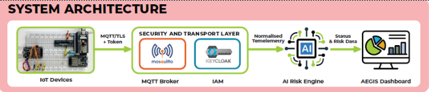
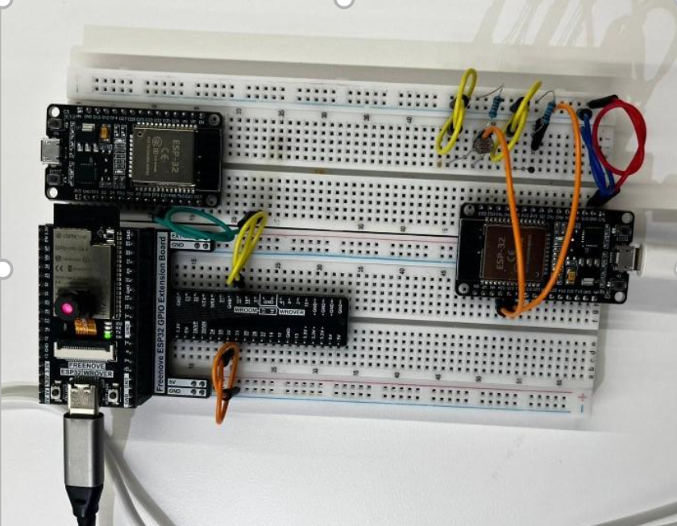
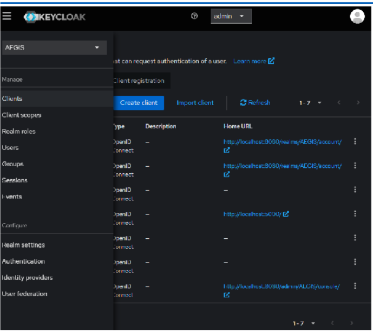
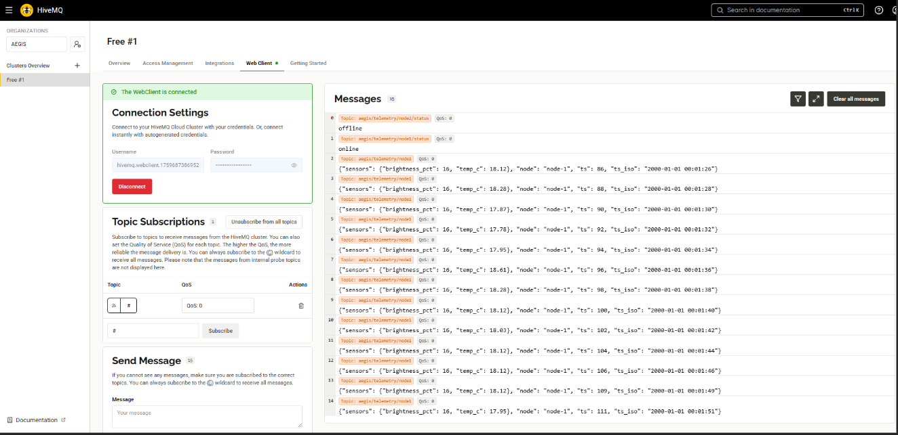
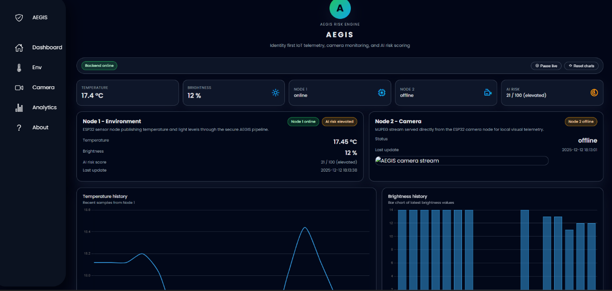

# Project AEGIS  
**Secure IoT Pipeline with Identity, Encrypted Telemetry, and Risk Detection**

Project AEGIS is a cybersecurity-focused Internet of Things (IoT) system designed to demonstrate how connected devices can be **securely authenticated, monitored, and analyzed** for abnormal or risky behavior.

Many IoT systems focus on connectivity first and security later. This project takes the opposite approach: **security is enforced at every stage of the pipeline**.

---

## Project Goals
The main goals of Project AEGIS are to:

- Prevent untrusted devices from communicating with the system
- Ensure all telemetry is transmitted securely
- Continuously monitor device behavior
- Detect abnormal or suspicious activity early
- Provide clear visibility through a centralized dashboard
- Demonstrate real-world IoT security architecture using physical devices

---

## Problems This Project Addresses
Common IoT security issues include:
- Devices that authenticate weakly or not at all
- Unencrypted telemetry data
- No visibility into device behavior
- No detection of abnormal activity
- Lack of centralized monitoring

Project AEGIS addresses these issues by combining **identity management, encrypted communication, risk analysis, and visualization** into a single system.

---

## System Architecture Overview
The diagram below shows the full system architecture and how each component interacts.



### Architecture Breakdown
1. **IoT Devices (ESP32)**  
   Physical devices that generate telemetry data.

2. **Authentication & Identity Management**  
   Devices and users must authenticate before accessing system resources.

3. **Secure Telemetry Transport (MQTT)**  
   All telemetry data is sent using encrypted messaging.

4. **Risk & Anomaly Analysis Engine**  
   Incoming data is evaluated for abnormal patterns or risky behavior.

5. **Web Dashboard**  
   Displays telemetry, device status, and calculated risk scores.

---

## Physical IoT Devices (ESP32)
This project uses **real ESP32 devices**, not simulations.



### Why Physical Devices Matter
Using real hardware:
- Demonstrates real-world constraints
- Shows how security controls apply to actual devices
- Reflects realistic IoT deployment scenarios

### Device Capabilities
Each ESP32 device:
- Connects to the network
- Authenticates before sending data
- Sends telemetry such as status and readings
- Can be monitored individually in the dashboard

---

## Identity and Authentication
Authentication is required for **both users and system components**.



### What Authentication Enforces
- Only authorized users can access the dashboard
- Devices must prove their identity before sending data
- Unauthorized devices are rejected
- Access is controlled using roles and permissions

This prevents:
- Device spoofing
- Unauthorized access
- Data injection by rogue devices

---

## Secure Telemetry Flow
The following diagram illustrates how telemetry moves securely through the system.



### Telemetry Flow Explained
1. ESP32 devices generate telemetry data
2. Data is transmitted using encrypted MQTT
3. Backend services receive and validate the data
4. Risk analysis is performed
5. Results are stored and visualized in the dashboard

All telemetry is protected **in transit**, reducing the risk of interception or manipulation.

---

## Risk and Anomaly Detection
A key component of Project AEGIS is the **risk engine**.

### Purpose of the Risk Engine
The risk engine:
- Analyzes incoming telemetry
- Identifies unusual or suspicious patterns
- Assigns a risk score to device activity
- Helps detect potential compromise or malfunction

This enables **continuous monitoring**, rather than relying on manual checks.

---

## Monitoring Dashboard
The dashboard provides a centralized view of the system.



### Dashboard Capabilities
From the dashboard, users can:
- View connected devices
- Monitor live telemetry updates
- Observe calculated risk scores
- Identify abnormal behavior early
- Gain visibility into overall system health

The dashboard turns raw telemetry into **actionable security insight**.

---

## Containerized Deployment
The entire system is containerized using Docker.

### Why Docker Is Used
- Consistent deployment across environments
- Easier setup and teardown
- Clear separation of services
- Simplified testing and demonstration

### Running the Project
```bash
docker-compose up --build
